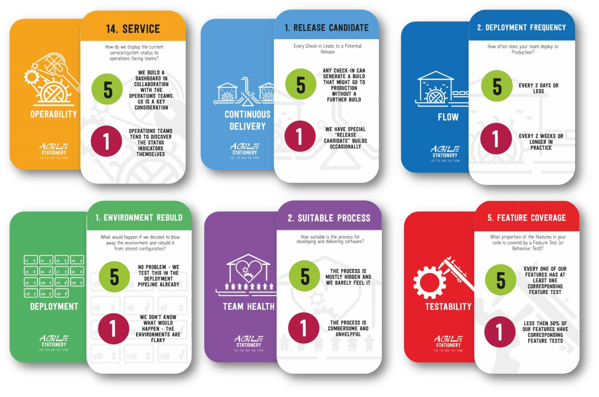
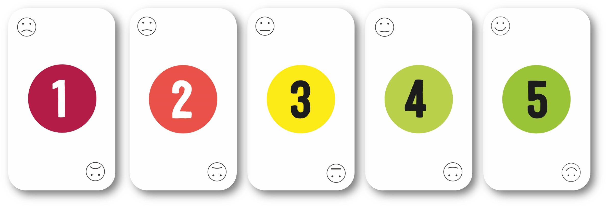

# Multi-team Software Delivery Assessment

The Multi-team Software Delivery Assessment is a simple, easy-to-execute approach to assessing software delivery across many different teams within an organisation. Devised by [Matthew Skelton](https://github.com/matthewskelton) of [Conflux](https://confluxdigital.net/), it is used as a key part of the [Software Delivery Assessment at Conflux](https://confluxdigital.net/assessments), but can be used freely by anyone (subject to the CC BY-SA license below).

The assessment uses and builds on the well-known and proven [Spotify Squad Health Check model](https://labs.spotify.com/2014/09/16/squad-health-check-model/). 

> Translations: [Japanese (ja 🇯🇵)](translations/ja/README.ja.md)

The assessment covers six dimensions in total: 

1. [Team Health](team-health.md)
2. [Deployment](deployment.md)
3. [Flow](flow.md)
4. [Continuous Delivery](continuous-delivery.md)
5. [Operability](operability.md)
6. [Testing and Testability](testability.md)

These six dimensions cover all key aspects of modern software delivery in a form that enables teams to self-assess their strengths and practices.

**🚀 Overview**: see slides 32-38 in [Continuous Delivery at scale](https://www.slideshare.net/matthewskelton/continuous-delivery-at-scale-matthew-skelton-nhs-digital-agile-cop-march-2019)

**🃏 Card deck**: make the assessment fun and interactive by using [the 66-card Software Delivery Assessment printed card deck from Agile Stationery](https://agilestationery.co.uk/pages/software-delivery-assessment). Developed in collaboration with Conflux, the card deck has _Tired_ and _Inspired_ indicators for each of the assessment criteria, together with emoji cards for quick-fire voting from team members. The card deck works for remote assessments too!

  

> Copyright © 2018-2020 [Conflux Digital Ltd](https://confluxdigital.net/)
> 
> Licenced under [CC BY-SA 4.0](https://creativecommons.org/licenses/by-sa/4.0/) 
>
> _Permalink: [SoftwareDeliveryAssessment.com](http://SoftwareDeliveryAssessment.com/)_

## Purpose of the assessments

The aim of the assessments is to promote and sustain a positive working environment for building and running software systems where:

  - Changes to software are built, tested, and deployed to Production **rapidly and safely** using Continuous Delivery practices
  - Processes and practices are **optimised for the flow of change** towards Production
  - Software is designed and built to enable **independent, decoupled deployments** for separate families of systems
  - Software is designed and built in a way that addresses **operability**, **testability**, and **releasability**
  - Problems in Production are always **detected by teams** before customers and users notice
  - Responsibility and **accountability** for software changes lead to empowerment and ownership
  - Working with software is **rewarding** and interesting
  - People feel **confident to challenge poor practices** and approaches

Fundamentally, the assessments should help to **unblock and enable teams** so they can succeed. The assessments should **help teams to improve how they build, test, and deploy software systems** through identifying different kinds of improvements:

1.  Team-focused improvements
2.  Product-focused and Service-focused improvements
3.  Organisation-wide improvements

The assessments should NOT be used to penalize teams, but to provide a shared drive towards improving practices and quality.

## Teams included in the assessments

Every team writing code, scripts, and/or configuration for application software or infrastructure will benefit from being included in the assessments:

  - Teams building **user-** and **customer-facing websites and services**
  - Teams building **internal services**
  - Teams building **infrastructure** to support other systems (including Platform teams)
  - Teams building **build & deployment** tooling and scripts
  - Teams **configuring and testing COTS products** as part of the software & infrastructure estate
  - Any other teams with a primary focus on **building, configuring, and testing software and infrastructure**

By "team", we mean 6-10 person group that works together closely, usually called a *Squad*, *Scrum team*, *Product team*, or *Stream-aligned team*. 

## Assessment criteria

The criteria for each dimension are taken from existing published books and online sources: 

* **Team Health** - based on the criteria from [_Spotify Squad Health Check_](https://labs.spotify.com/2014/09/16/squad-health-check-model/) with some additions
* **Deployment** - based on key questions from the book [_DevOps for the Modern Enterprise_](https://itrevolution.com/book/devops_modern_enterprise/) by Mirco Hering as discussed on Mirco's blog post [Mirco’s self assessment questions of DevOps Maturity](https://notafactoryanymore.com/2018/03/01/mircos-self-assessment-questions-of-devops-maturity/)
* **Flow** - based on criteria from the book [_Accelerate_](https://itrevolution.com/book/accelerate/) by Nicole Forsgren, Jez Humble, and Gene Kim, plus some details from [_The Principles of Product Development Flow_](https://www.amazon.com/Principles-Product-Development-Flow-Generation/dp/1935401009) by Don Reinertsen
* **Continuous Delivery** - based on selected criteria the book [_Continuous Delivery_](https://www.amazon.com/Continuous-Delivery-Deployment-Automation-Addison-Wesley/dp/0321601912) by Jez Humble and Dave Farley and the summary of the book at [CDchecklist.info](http://CDchecklist.info/)
* **Operability** - based on selected criteria from the book [_Team Guide to Software Operability_](http://operabilitybook.com/) by Matthew Skelton, Alex Moore, and Rob thatcher, together with some questions from [OperabilityQuestions.com](http://OperabilityQuestions.com/)
* **Testing and Testability** - based on selected criteria from the books [_Agile Testing_](https://wordery.com/agile-testing-lisa-crispin-9780321534460) by Lisa Crispin and Janet Gregory, [_Continuous Delivery_](https://www.amazon.com/Continuous-Delivery-Deployment-Automation-Addison-Wesley/dp/0321601912) by Jez Humble and Dave Farley, [_Growing Object-Oriented Software_](https://wordery.com/growing-object-oriented-software-guided-by-tests-steve-freeman-9780321503626) by Steve Freeman and Nat Price, [_Working Effectively with Legacy Code_](https://www.amazon.co.uk/Working-Effectively-Legacy-Michael-Feathers/dp/0131177052) by Michael Feathers, [_Team Guide to Software Testability_](http://testabilitybook.com/) by Ash Winter and Rob Meaney, and [TestabilityQuestions.com](http://TestabilityQuestions.com/).

## How to run the assessments

The assessment session itself should feel somewhat like a team retrospective session. The main difference from a normal retrospective session is that in the team assessment session the facilitator guides the discussion more firmly. There are many questions to discuss and it's important that the team discusses all of the criteria in the time available.

At the end of the assessment session, the team should feel encouraged and empowered to decide on what actions they want to take to improve their processes and practices based on the discussions.

### Cadence

Many organisations find that running team assessments **every 3 months** provides a good result.

### Preparation

1.  Find someone to Facilitate the assessment. This should be someone from outside the team, who is familiar with running team retrospectives.  
2.  Book a room large enough for the team, for 2 hours 
3.  Print the assessment sheets for each set of criteria, either using the [ready-made A1 PDF (see Releases)](https://github.com/ConfluxDigital/software-delivery-assessment/releases), or the individual assessment pages at A1 size if possible (use small margins):
	* [Team Health - assessment sheet](print/print-team-health.md)
	* [Deployment - assessment sheet](print/print-deployment.md)
	* [Flow - assessment sheet](print/print-flow.md)
	* [Continuous Delivery - assessment sheet](print/print-continuous-delivery.md)
	* [Operability - assessment sheet](print/print-operability.md)
	* [Testing and Testability - assessment sheet](print/print-testability.md)
4.  Print the details pages as a guide (or have the pages open on-screen) to understand the context and details of each of the assessment criteria:
	1. [Team Health](team-health.md)
	2. [Deployment](deployment.md)
	3. [Flow](flow.md)
	4. [Continuous Delivery](continuous-delivery.md)
	5. [Operability](operability.md)
	6. [Testing and Testability](testability.md)
5.  Bring lots of marker pens or whiteboard markers: red, blue, and green are best.
6.  Include **someone who is familiar with facilitating retrospectives** (possibly a scrum master) in the session. They will be shadowing the facilitator during the session so the person from your team can facilitate other assessment sessions later.

Make sure that the Facilitator understands the purpose of the session and is familiar with the assessment pages and questions.

> **Facilitators**
> 
> The facilitator should familiarise themselves with the [Spotify Squad Health Check](https://labs.spotify.com/2014/09/16/squad-health-check-model/) approach before running the session. See [How I Used the Spotify Squad Health Check Model](http://www.barryovereem.com/how-i-used-the-spotify-squad-health-check-model/) for a good experience report, [Squad Health Checks](https://engineering.skybettingandgaming.com/2017/02/01/squad-health-checks/) from SkyBet, and download instructions from Spotify ([PDF](https://spotifylabscom.files.wordpress.com/2014/09/squad-health-check-model2.pdf)).
>
> During the assessment:
> 
> *	Keep the team on schedule by asking for some discussions to be held outside the session
> * Write down the team scores and notes on the printed assessment sheets
> * Take photographs of the completed assessment sheets
> * Get feedback from the team on the VALUE and EXECUTION of the engineering assessment - smiley faces are sufficient
> 

### Timings

Each team assessment runs for 2 hours, and the facilitator will run the team through 6 sets of questions:

1.  Team health check - **35 mins**
2.  Deployment health check - **10 mins**
3.  Flow check - **10 mins**
4.  Continuous Delivery check - **20 mins**
5.  Operability check - **20 mins**
6.  Test coverage check - **20 mins**

These timings leave space for a **5 minute break** during the assessment.

### Running the Assessment session

Each section has several questions. Each question should be answered as follows:

  - The team (either as individuals or as a team) rate each of the criteria using SAD (1 OR 2) / MEH (3) / YAY (4 OR 5) based on the ***Tired* and *Inspired*** guidelines
    
      - *Tired* aligns to a low rating (1), and *Inspired* aligns to a high rating (5)
    
      - If you used individual ratings, tally the ratings and/or decide on a single team score from 1 to 5. You may find it useful to use different coloured pens on the printed sheet to indicate visually the different ratings.

  - The **Trend** since the previous time is identified (going up, staying roughly the same, going down), if applicable

  - An **Action** agreed to improve the score for that question over the coming months.

  - Use the **Notes** column to indicate further information that you think is valuable for the coordinating team to know about.

  - Make sure to complete to the **Date/Name/Facilitator** details on the bottom of each sheet.

  - Take a photo of each completed sheet and send to the person coordinating the assessments

  -  Get team members to rate the assessment session itself in terms of: **Value**, **Execution** (sad, meh, happy faces)

### Viral facilitation

Each team assessment session has present one person who is shadowing the facilitator so that they can themselves facilitate future sessions. Each new facilitator should facilitate at least 2 sessions with other teams. In this way, the number of facilitators expands rapidly, enabling a minimal burden on the initial facilitators.

## Coordinating and interpreting the results

After teams have each run an assessment session and sent their results, the coordintating group should collate the results from different teams to identify any areas that need improving across the organisation. Ask questions such as:

* Why does team ABC rate themselves as 1 for test coverage? What is hindering them?
* What can we do as an organisation to help more teams with deployments?
* Is there an aspect of the Platform that needs improving so teams can go faster?

Do not attempt to rank or compare teams directly. Instead, use the signals from the teams to understand the organisational dynamics better and then prioritise organisation-wide improvements.

