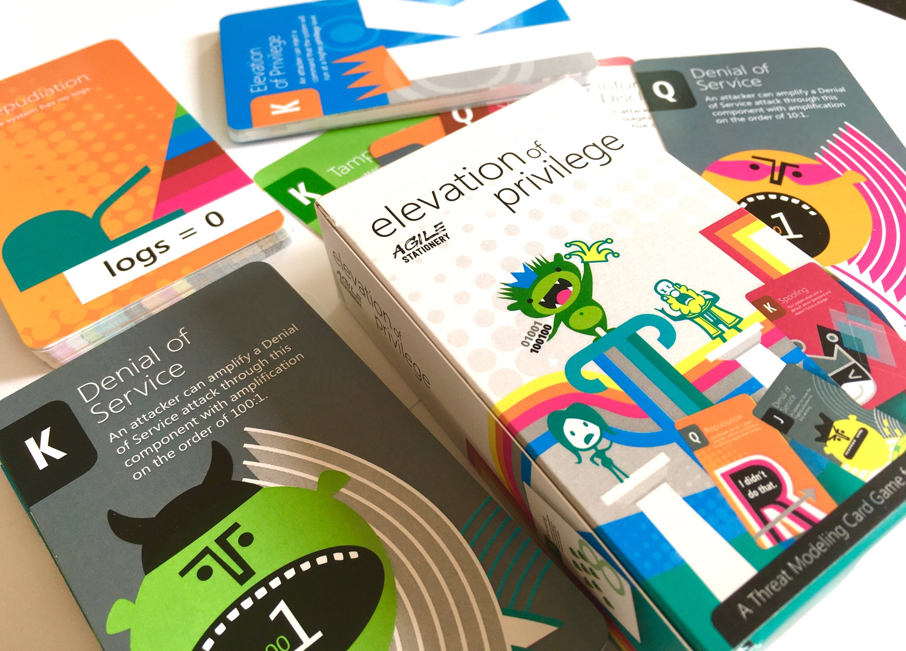

# Security and Securability check

> **Part of the Multi-team Software Delivery Assessment** ([README](README.md))
> 
> Copyright © 2018-2021 [Conflux Digital Ltd](https://confluxdigital.net/)
> 
> Licenced under [CC BY-SA 4.0](https://creativecommons.org/licenses/by-sa/4.0/) 
>
> _Permalink: [SoftwareDeliveryAssessment.com](http://SoftwareDeliveryAssessment.com/)_ 

Based on selected criteria from the following books:

* [_Agile Application Security_](https://www.oreilly.com/library/view/agile-application-security/9781491938836/) by Laura Bell, Michael Brunton-Spall, Rich Smith, Jim Bird
* [_Alice and Bob Learn Application Security_](https://www.wiley.com/en-gb/Alice+and+Bob+Learn+Application+Security-p-9781119687405) by Tanya Janca
* [_Secure by Design_](https://www.manning.com/books/secure-by-design) by Dan Bergh Johnsson, Daniel Deogun, Daniel Sawano
* [Continuous Delivery](http://continuousdelivery.com/) by Jez Humble and Dave Farley
* [Threat Modeling: Designing for Security](https://shostack.org/books/threat-modeling-book) by Adam Shostack

The [OWASP Top Ten](https://owasp.org/www-project-top-ten/) list of application security risks is an excellent starting point for assessing security and securability in software. The game [Elevation of Privilege](https://www.microsoft.com/security/blog/2010/03/02/announcing-elevation-of-privilege-the-threat-modeling-game/) by Adam Shostack was also an influence, especially in the [card deck format provided by Agile Stationery](https://agilestationery.com/collections/cybersecurity-games/products/elevation-of-privilege-game).

Purpose: *Assess the approach to security and securability practices within the software system.* 

Method: Use the [*Spotify Squad Health Check*](https://labs.spotify.com/2014/09/16/squad-health-check-model/) approach to assess the team's answers to the following questions, and also capture the answers:

| **Question**                                                                                                                                                                           | **Tired (1)**                                                                    | **Inspired (5)**                                                                                                                                                                                                                     |
| -------------------------------------------------------------------------------------------------------------------------------------------------------------------------------------- | -------------------------------------------------------------------------------- | ------------------------------------------------------------------------------------------------------------------------------------------------------------------------------------------------------------------------------------ |
| 1\. **OWASP Top Ten** - Do you check for the the [OWASP Top Ten](https://owasp.org/www-project-top-ten/) security risks?                                                                                   | We check for some of the OWASP Top Ten occasionally or manually.                                         | We have automated checks for the OWASP Top Ten that run on every commit/check-in to our deployment pipeline.                                                                                                                                                                                  |
| 2\. **Secure Design Principles** - What is the approach to security and compliance?                                                                | Compliance with a defined set of criteria is more important than taking the time to do good design.                            | [We value a culture of finding and fixing design issues over checkbox compliance.](https://www.threatmodelingmanifesto.org/#values)                                                                                                                                                 |
| 3\. **Threat Modeling** - How do you approach threat modeling?                                                                    | We build a system and put changes into production. Later,  we might ask an expert outside the team to try and break it.                           | We model our system and review it for threats whenever we are performing design work. We use the [four questions frame](https://github.com/adamshostack/4QuestionFrame) [1) What are we working on? 2) What can go wrong? 3) What are we going to do about it? 4) Did we do a good job?] to provide structure and repeatability to the process.                                                                                                                                                 |
| 4\. **Domain-driven Security** - In what ways to you work with domain experts to help make code secure?                                                    | We use domain experts to define software features but not secure code.                                       | We use the expertise and viewpoints of domain experts to help us model the domain accurately with deep modeling and domain invariants. This leads to code that is inherently more secure because it uses more specific data types, not just the primitives like `String`, `integer`, etc.                                                                                                                                                                                          |
| 5\. **Input Testing** - What kind of input testing do you perform in the deployment pipeline?                                                          | We do not test the inputs into the software application **or** we rely on client-side validation only.                   | We perform at least four types of input testing: Normal input (input that confirms to domain rules), Boundary input (input that conforms only to structural correctness), Invalid input (input like `null` and strange characters), and Extreme input (such as 40 million characters).                                                                                                                                                                 |
| 6\. **Least Privilege** - What approach to you take to access permissions for the accounts used to run your software?                                                       | We don't have a consistent account access policy OR some daemon/Service accounts run as root/Administrator                                | We use the Principle Of Least Privilege to restrict ALL daemon/Service accounts to the bare minimum permissions needed. Access via interactive logins is highly restricted.                                                                                                                               |
| 7\. **Supply-Chain Security** - How do you verify the quality and safety of the external software components used in your software?                                                    | We do not do any supply-chain validation of external code OR we manually verify every line of code in every external component or libary.                                     | We use an open source or commerical code scanning and notification tool to track, report, and alert on vulnerabilities and malicious code in all external code components and libraries.                                                                               |
| 8\. **HTTPS Everywhere** - Where is HTTPS (HTTP over TLS/SSL) used within your software?                                                                                       | HTTPS is used for the externally-accessible services and applications only. Internal applications and services use insecure HTTP only OR Some of our publicly accessible services use insecure HTTP.                                 | All our endpoints - internal and external - use HTTPS (with TLS 1.2 or later) or equivalent secure transport. Security certificates are renewed and installed automatically via a service like [LetsEncrypt](https://letsencrypt.org/).                                                                                                                                                     |
| 9\. **Automated Security Testing** - What kind of automated security testing is performed on your code and when?                                    | We don't do any automated security testing OR we run automated security testing at the end of a development cycle                     | We run automated security checks on the code automatically on every check-in/commit (using tools such as [OWASP ZAP](https://www.zaproxy.org/)) AND software developers can run similar checks _before_ code check-in/commit to increase their awareness of security issues.| 
| 10\. **Responsibility for Security** - Who is responsible for the security and securability of your software?                                    | A separate Security team reviews our code and performs a "sign-off" before deployment to production/live.                     | We (the engineers developing the software) are responsibilie for the security and securability of the software. We seek and get regular help and mentoring from security experts, and we use security and securability features from an internal platform (or external tools) to help us make our software secure and securable. | 
| 11\. **Policy as Code** - Are security policies defined in code (or configuration) and testable?                                    | We do not use policy-as-code for defining and testing security policies.                     | We use policy-as-code (such as [Open Policy Agent](https://www.openpolicyagent.org/)) for defining and testing security policies. The policy-as-code is co-authored with security experts together with engineers. | 

